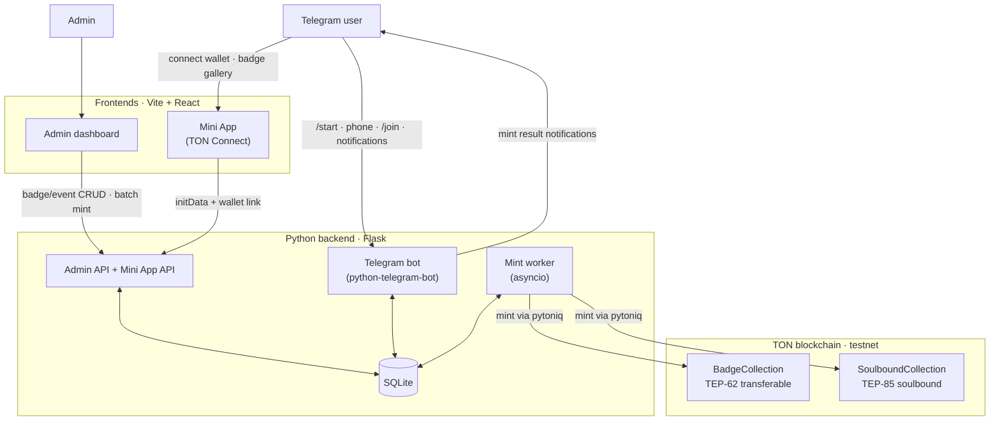
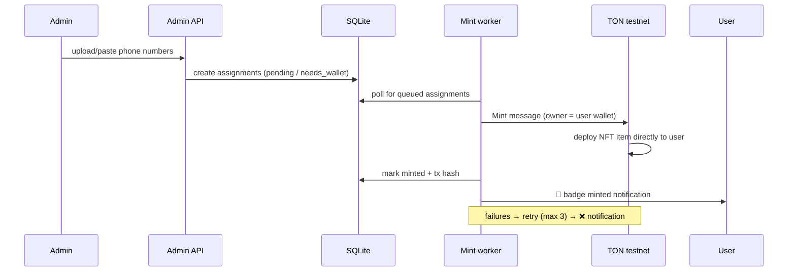

# UnityCommunity NFT Telegram Bot

> ## ⚠️ DISCLAIMER — DEMO / PRESENTATION ONLY
>
> **This repository exists solely for a simple presentation in a group.**
> It is **NOT intended for production** and **NOT for any real-world use**.
>
> - No security review has been performed.
> - Keys, secrets, and wallet flows are NOT hardened.
> - Nothing here should be deployed to mainnet or used with real funds, real
>   user data, or real phone numbers.
> - Treat everything in this repo as a throwaway demo of the concept.

---

## What it is

A web3 event-badge platform on Telegram: users verify their phone number with
a bot, connect their **TON wallet (Telegram Wallet)**, and receive **NFT
badges** that admins mint in bulk from a list of phone numbers.

```
  USER                          ADMIN
   │  /start + share phone      │  create badge type (art, soulbound?)
   │  connect TON wallet        │  create event
   │  join event                │  upload/paste phone numbers
   ▼                            ▼
      ┌──────────────────────────────────┐
      │  Backend maps phone → user →     │
      │  wallet → mints badge on TON     │
      └──────────────────────────────────┘
   │                                              │
   ▼                                              ▼
 badge in wallet / Mini App gallery       status per user (pending→minted/failed)
```

### The core flow

1. User opens the bot → `/start` → taps **"Share phone number"**
   (`request_contact`). The bot stores `telegram_id → phone`.
2. Bot sends a link to the **Telegram Mini App** where the user connects their
   Telegram Wallet via **TON Connect**.
3. Backend verifies the Mini App `initData` (HMAC with the bot token) and
   stores the linked wallet address.
4. Admin creates a badge type + event in the dashboard, then uploads or pastes
   a list of phone numbers.
5. The backend maps each phone → user → wallet and the **mint worker** mints
   one badge per user on TON (testnet), notifying the user via the bot.
6. Badges show up in the user's wallet and the Mini App gallery.

---

## Architecture

```
┌────────────────────────────────────────────────────────────────────┐
│                            TON blockchain                          │
│   BadgeCollection (TEP-62) / SoulboundBadgeCollection (TEP-85)     │
└──────────────▲───────────────────────────────▲─────────────────────┘
               │ mint (pytoniq liteserver)     │
┌──────────────┴───────────────────────────────┴─────────────────────┐
│                        Python backend (Flask)                      │
│   • Mini App API  (wallet link, badge gallery, initData verify)    │
│   • Admin API     (badge/event CRUD, batch mint, status)           │
│   • Mint worker   (asyncio queue, retries, notifications)          │
│   • SQLite (SQLAlchemy)                                            │
└──────────────▲───────────────────────────────▲─────────────────────┘
               │                               │
   ┌───────────┴───────────┐       ┌───────────┴───────────┐
   │  Telegram bot         │       │  Frontends            │
   │  (python-telegram-    │       │  • TON Mini App       │
   │   bot)                │       │  • Web admin dashboard│
   │  onboarding, /join,   │       │  (Vite + React)       │
   │  notifications        │       └───────────────────────┘
   └───────────────────────┘
```

> **Stack note:** the original plan proposed `aiogram`/`FastAPI`; they were
> swapped for `python-telegram-bot`/`Flask` because `pydantic-core` requires
> Rust to build, which was unavailable in the original environment.

### Project diagram



### Key design decisions

| Decision | Why |
|---|---|
| **Phone is the admin's key** | phone → telegram_id → wallet chain stored in SQLite |
| **One collection contract per badge type** | "transferable vs soulbound" is a contract-level property the admin picks per badge |
| **Custom `Mint` body with recipient in it** | mints the badge **directly to the user's wallet** in one transaction (see [Contract ↔ client compatibility](#contract--client-compatibility)) |
| **`WalletV4R2` + LiteBalancer via pytoniq** | real on-chain minting with retries from a background worker |
| **`initData` HMAC auth for the Mini App** | Telegram identity without a login flow |
| **SQLite** | fine at demo scale; schema is portable to Postgres |

---

## Repository layout

```
UnityCommunityNftBot/
├── bot/                     # Telegram bot (python-telegram-bot)
│   └── main.py              # /start, phone capture, /join, wallet prompt
├── backend/                 # Flask backend + mint worker
│   ├── main.py              # Flask entry point (health, blueprints, DB init)
│   ├── api/                 # admin.py + mini_app.py (Flask blueprints)
│   ├── db/                  # SQLAlchemy models + session factory
│   ├── services/            # assignment, attendee, initdata, notify, ton, user
│   └── worker.py            # mint queue worker (atomic claims, retries, notify)
├── contracts/               # Tact smart contracts
│   ├── transferable/        #   TEP-62 badge collection
│   ├── soulbound/           #   TEP-85 soulbound collection
│   ├── build/               #   compiled artifacts (gitignored)
│   ├── deploy/              #   deploy scripts (testnet, pending)
│   └── tests/               #   sandbox test suites (10 tests)
├── web/                     # Frontends (Vite + React, pending)
│   ├── miniapp/             #   TON Connect wallet linking + badge gallery
│   └── admin/               #   admin dashboard
├── tests/                   # Python test suite (52 tests)
├── PLAN.md                  # full project description and plan
├── TODO.md                  # step-by-step checklist with commit checkpoints
└── README.md
```

---

## Prerequisites

- **Python 3.10+** (developed on 3.14)
- **Node.js 18+ and npm** (only needed for the smart contracts and frontends)
- A **Telegram bot token** from [@BotFather](https://t.me/BotFather)
- (Optional, for real mints) a **TON testnet wallet** and its 24-word mnemonic
  — the deployer/minting hot wallet

---

## Setup

### 1. Backend + bot

```bash
# Create a virtualenv and install dependencies
python -m venv .venv
source .venv/bin/activate        # Windows: .venv\Scripts\activate
pip install -r requirements.txt

# Configure environment
cp .env.example .env             # then fill in BOT_TOKEN etc. (see below)

# Boot the Flask API (creates SQLite tables on start)
python backend/main.py           # http://localhost:8000

# In a second terminal, boot the Telegram bot
python bot/main.py               # polls Telegram for /start, /join, contacts
```

Run the **mint worker** (needs `DEPLOYER_MNEMONIC` + TON network access):

```bash
python -m backend.services.ton   # runs MintWorker with the pytoniq client
```

### 2. Tests

```bash
python -m pytest tests/ -v       # 52 tests, all offline (no network needed)
```

### 3. Smart contracts (Tact)

```bash
cd contracts
npm install
npm run build                    # compiles to contracts/build/
npm test                         # 10 sandbox tests for both collections
```

> **Status:** both collections compile and their sandbox tests pass. Testnet
> deployment is the remaining Phase 1 step (needs a funded testnet wallet).
> Note that **Tact is deprecated** upstream in favor of Tolk (the compiler
> still works and matches the project plan).

### 4. Frontends (Vite + React)

Not scaffolded yet (tracked in `TODO.md`, Phase 3/4):

```bash
cd web/miniapp    # TON Connect wallet linking + badge gallery
npm install
npm run dev       # http://localhost:5173 (proxies /miniapp → :8000)

cd web/admin      # admin dashboard (badge/event CRUD, batch mint)
npm install
npm run dev       # http://localhost:5174
```

---

## Configuration (`env`)

| Variable | Default | Purpose |
|---|---|---|
| `BOT_TOKEN` | — | Telegram bot token (**required**) |
| `TON_NETWORK` | `testnet` | `testnet` or `mainnet` |
| `TON_API_KEY` | — | TonAPI key (read calls; integration pending) |
| `DEPLOYER_MNEMONIC` | — | 24-word mnemonic of the minting hot wallet |
| `DATABASE_URL` | `sqlite:///./data.db` | SQLAlchemy URL |
| `MINI_APP_URL` | `http://localhost:5173` | Mini App origin (CORS + bot button) |
| `ADMIN_WEB_URL` | `http://localhost:5174` | Admin dashboard origin (CORS) |
| `ADMIN_PASSWORD` | `change_me` | Planned shared password for the dashboard |
| `DEBUG` | `false` | SQL echo + Flask debug reloader |

---

## API reference

All responses are JSON.

### Admin API (`/admin`) — no auth yet (Phase 5)

| Method | Path | Description |
|---|---|---|
| GET/POST | `/admin/badge-types` | List / create badge types |
| GET/PUT/DELETE | `/admin/badge-types/<id>` | Read / update / delete |
| GET/POST | `/admin/events` | List / create events |
| GET/PUT/DELETE | `/admin/events/<id>` | Read / update / delete |
| POST | `/admin/assignments` | Batch mint: `{"badge_type_id": 1, "phones": [...]}` |
| POST | `/admin/assignments/upload` | Same, from a CSV file (`badge_type_id` + `file`) |
| GET | `/admin/assignments` | List jobs, optional `?status=<status>` |
| POST | `/admin/assignments/<id>/status` | Transition: `{"status": "queued"}` (409 on illegal jump) |

### Mini App API (`/miniapp`) — authenticated by Telegram `initData`

| Method | Path | Description |
|---|---|---|
| POST | `/miniapp/wallet` | Link wallet: `{"init_data": ..., "wallet_address": "EQ..."}` |
| GET | `/miniapp/badges` | Gallery of minted badges (send `X-Telegram-Init-Data` header) |

`initData` is verified per
[Telegram's WebApp spec](https://core.telegram.org/bots/webapps#validating-data)
and rejected if older than 24 h (replay protection).

### Health

| Method | Path | Description |
|---|---|---|
| GET | `/health` | Liveness probe |

---

## How the mint pipeline works



Each badge grant is an **assignment** row that moves through a strict state
machine:

```
pending → queued → minting → minted
                ↘ failed (retries up to MAX_RETRIES = 3)
                ↘ needs_wallet (parked until the user links a wallet)
```

1. **Admin** uploads phone numbers → `create_assignments_for_phones` matches
   them to users (dedup per badge+user) and creates jobs.
2. **Worker** (`backend/worker.py`) polls for `queued` jobs and atomically
   claims each one (`queued → minting`), so parallel workers never double-mint.
3. **PytoniqTONClient** (`backend/services/ton.py`) sends a `Mint` message to
   the collection contract, returning the message hash as the tx hash.
4. Success → `minted` + 🎉 notification. Failure → retry, then `failed` + ❌
   notification. Missing wallet → `needs_wallet` (no spam).

### Contract ↔ client compatibility

The Python client and the Tact contracts share one custom `Mint` body layout:

```
op:uint32(1) · query_id:uint64 · index:uint64 · amount:coins ·
owner:address · common_content:ref · forward_payload:ref
```

The `owner` field mints the badge **directly to the recipient's wallet**.
`backend/services/ton.py` and both `contracts/*/*_collection.tact` files must
stay in sync — if one changes, change the other.

---

## Troubleshooting

| Symptom | Fix |
|---|---|
| `BOT_TOKEN is not set` | Set `BOT_TOKEN` in `.env` |
| `No module named 'sqlalchemy'` | `pip install -r requirements.txt` |
| `invalid init_data` (401) | initData is stale (>24 h) or from another bot — reopen the Mini App |
| Worker: `DEPLOYER_MNEMONIC is not set` | Add the deployer wallet mnemonic to `.env` |
| `wallet activation not confirmed` | Testnet wallet has no balance or the init message was dropped — fund it and retry |
| Mint stays `needs_wallet` | The user hasn't connected a wallet in the Mini App yet |

---

## Status / roadmap

| Phase | Status |
|---|---|
| 0 · Foundations | ✅ Complete |
| 1 · Contracts | 🟡 Written, compiled, tested; testnet deploy pending |
| 2 · Bot Onboarding | 🟡 Code done; live e2e pending |
| 3 · Mini App | 🟡 Backend done; frontend pending |
| 4 · Admin + Batch Mint | 🟡 Backend done; frontend + live mint pending |
| 5 · Hardening | 🟡 Retries + notifications done; admin auth/README pending |

Live E2E steps (require a real bot token + testnet wallet):

1. Run backend + bot, share a phone via `/start`.
2. Open the Mini App, connect a wallet (address stored).
3. Create a badge type + event via the API, upload the test phone number.
4. Run the mint worker and confirm the badge is minted on testnet.

## License

None. For presentation purposes only — do not reuse in production.
